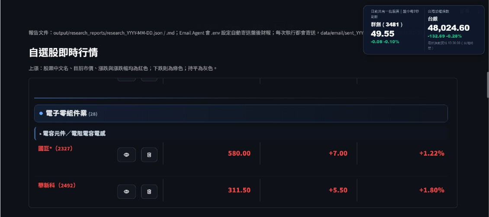
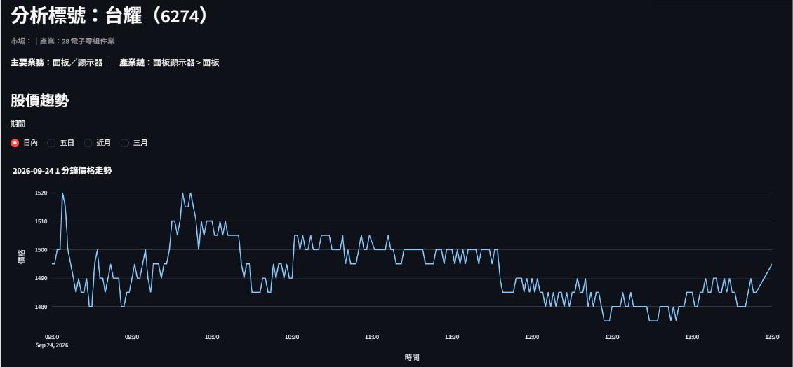
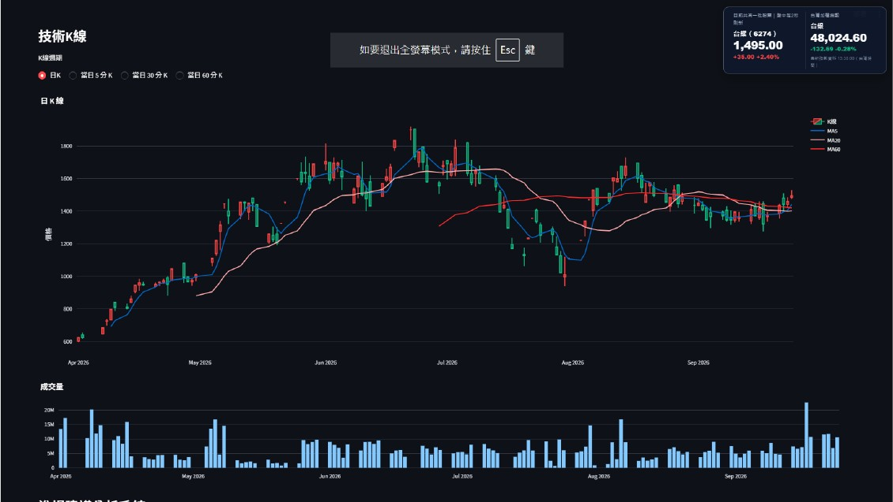
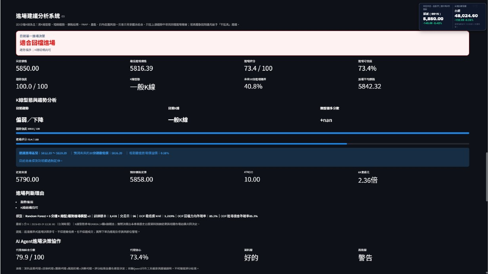
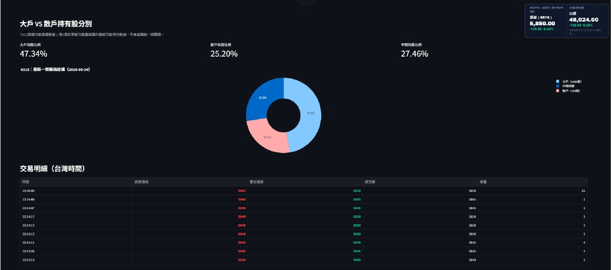
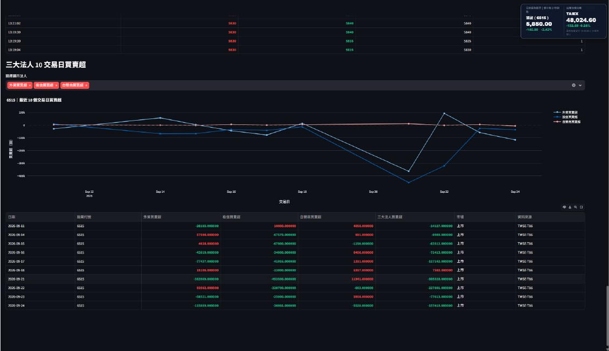
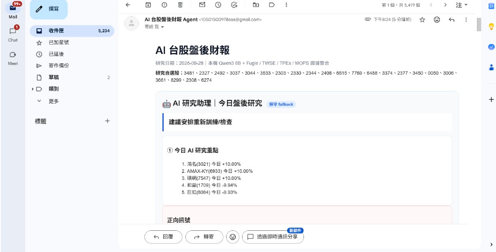
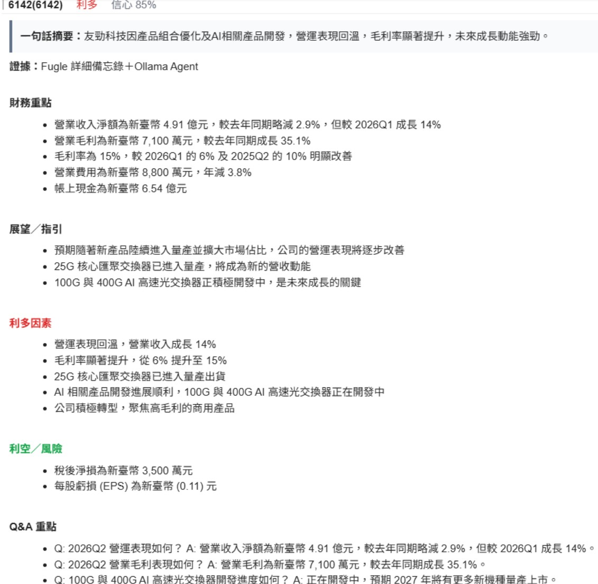

# 🤖 AI 台股研究助理

> **結合量化模型、新聞爬蟲與本機 AI Agent 的智慧台股研究系統**
> **我的網站:https://stocktrading-c66hschtsd2qh6vkyv4mtq.streamlit.app/**
> **一個 AI 研究助理幫你讀完一堆資料後，整理自己的研究筆記。**

[](https://www.python.org/)
[](https://streamlit.io/)
[](https://ollama.com/)
[](https://scikit-learn.org/)

## 🌐 Online Demo

**Streamlit Dashboard**

https://stocktrading-c66hschtsd2qh6vkyv4mtq.streamlit.app/

> 網站主要提供台股行情、個股研究、技術分析、籌碼資訊、AI 模型與研究結果的互動式介面。

---

# 🎯 專案介紹

這不是單純的「AI 猜股票」系統。

本專題以 **AI 研究助理** 為核心，將原本分散在不同平台的台股資訊集中起來，包括：

- 市場行情
- 公司基本資料
- 月營收
- EPS / 財報
- 三大法人
- 法人說明會
- 產業與公司業務
- 鉅亨網財經新聞
- 技術與量價資料

再交由本機 **Qwen3 8B + Ollama** Agent 進行研究。

Agent 不只是固定套用一組摘要模板，而是可以：

```text
取得資料
   ↓
閱讀市場資訊
   ↓
判斷哪些資訊值得研究
   ↓
選擇研究工具
   ↓
發現證據不足
   ↓
主動查找其他資料
   ↓
交叉比對
   ↓
整理研究結果
   ↓
形成 Agent Research Note
```

最終輸出：

**Dashboard + AI 預測 + 研究筆記 + 財經新聞摘要 + 法說會研究 + Email 報告**

---

# ⭐ 核心特色

| 功能 | 說明 |
|---|---|
| 📊 台股 Dashboard | Streamlit 互動式台股研究介面 |
| 🔮 AI 隔日預測 | Random Forest + 44 項技術與量價特徵 |
| 🧠 AI Research Agent | Qwen3 8B Tool Calling 自主研究 |
| 📰 財經新聞爬蟲 | 自動取得鉅亨網近期財經新聞 |
| 📣 法說會 Agent | 閱讀 Fugle 法說會詳細備忘錄 |
| 💰 財報／營收分析 | 整合 TWSE / TPEx / MOPS |
| 📈 市場異動分析 | 漲跌、5 日、20 日與產業聚合 |
| 🏷️ 利多題材分析 | 新聞、產業鏈、營收與公司業務交叉研究 |
| 🧠 Research Memory | 保存每日研究結果，形成跨日研究紀錄 |
| 📧 自動 Email | 自動產生早報／盤後研究 |
| ⏰ Windows Scheduler | 自動執行新聞爬蟲與研究流程 |

---

# 🖥️ 系統成果展示

## 1. 台股 Dashboard

系統以 Streamlit 建立互動式研究介面，將行情、個股、產業、籌碼與研究資訊集中在同一個操作入口。



---

## 2. 個股盤中價格

提供單一股票的價格趨勢，方便觀察交易時段內的價格變化。



---

## 3. 技術 K 線與成交量

整合 K 線、成交量與技術分析資訊，作為量價研究與 AI 模型的資料視覺化入口。



---

## 4. 個股研究分析

整合價格、模型訊號與相關研究資訊，提供個股目前研究狀態。



---

## 5. 籌碼結構

展示大戶與散戶持有比例及交易明細，輔助觀察市場籌碼結構。



---

## 6. 三大法人買賣超

提供外資、投信與自營商近 10 個交易日的買賣超趨勢。



---

## 7. AI 自動研究 Email

研究結果會透過 Email 自動寄送，讓使用者不需要每天手動開啟系統查看研究結果。



---

## 8. 法說會 AI Agent

將 Fugle 法說會備忘錄交由本機 Qwen3 8B Agent 進行分析，整理：

- 財務重點
- 營運展望
- 利多因素
- 風險
- Q&A



---

# 🧠 AI Research Agent

本專題最重要的特色不是「讓 LLM 寫摘要」，而是讓 Agent 參與研究流程。

## 傳統固定程式

```text
資料
 ↓
固定規則
 ↓
固定欄位
 ↓
固定報告
```

## 本專題 Agent

```text
資料
 ↓
Research Package
 ↓
Qwen3 8B Agent
 ↓
判斷研究需求
 ↓
選擇 Tool
 ↓
取得證據
 ↓
發現資料不足？
 ├─ 否 → 整理研究
 └─ 是 → 繼續查詢
          ↓
       新聞／財務／法說／產業
          ↓
       交叉驗證
          ↓
       Research Note
```

Agent 的核心工作是：

> **理解今天需要研究什麼、決定看哪些資料、發現證據不足時繼續查、最後整理成研究筆記。**

---

# 📰 財經新聞研究

系統整合鉅亨網頭條：

https://news.cnyes.com/news/cat/headline

新聞爬蟲採多層策略：

```text
CNYES 頭條
    ↓
新聞列表 API
    ↓ API 失敗
HTML
    ↓ 必要時
Selenium
    ↓
標題 / 時間 / 分類 / 摘要 / 正文 / 標籤 / URL
    ↓
JSON Cache
    ↓
Research Agent
```

新聞資料會保存至：

```text
output/research_reports/
└── cnyes_news_YYYY-MM-DD.json
```

Agent 不只是搜尋固定關鍵字，而是可以根據研究脈絡延伸相關概念。

例如：

```text
電子零組件
 ├─ PCB
 ├─ IC 載板
 ├─ ABF
 ├─ BT
 ├─ CCL
 ├─ 高速材料
 ├─ MLCC
 └─ 連接器
```

或：

```text
半導體
 ├─ 先進製程
 ├─ 封裝
 ├─ HBM
 ├─ 記憶體
 ├─ ASIC
 └─ GPU
```

因此市場出現異動時，Agent 可以進一步尋找可能的產業鏈脈絡，再與公司業務、營收、法人與法說資料交叉確認。

---

# 📣 法說會研究

資料來源：

- Fugle 法說會備忘錄
- 公司公開資料
- 財務資訊

研究流程：

```text
法說會事件
    ↓
Fugle 詳細備忘錄
    ↓
Qwen3 8B
    ↓
財務重點
    ↓
營運展望
    ↓
利多因素
    ↓
風險
    ↓
Q&A
```

近期法說會研究結果會進入研究包與 Email。

---

# 💰 財報與營收研究

系統整合：

- TWSE
- TPEx
- MOPS

主要研究：

- 最新月營收
- YoY
- EPS
- 財務表現
- 公司業務
- 產業脈絡

Email 顯示時會將：

```text
股票名稱 + 股票代號
```

一起呈現，例如：

```text
晶豪科（3006）
南亞科（2408）
群聯（8299）
```

避免只看到股票代號而需要另外查詢公司。

---

# 🔮 AI 隔日預測

量化模型與 LLM Agent 採取明確分工。

## Quant Model

負責：

- 下一交易日報酬
- 價格換算
- 上漲／下跌／盤整方向
- 上漲機率

## AI Agent

負責：

- 市場研究
- 新聞理解
- 法說會閱讀
- 財務研究
- 產業脈絡
- 證據整理
- 研究筆記

也就是：

> **模型負責數值，Agent 負責研究。**

---

## 🧮 模型特徵

目前使用 **44 項技術與量價特徵**，包含：

- 短中長期報酬
- 均線比例
- EMA
- RSI
- MACD
- Bollinger Bands
- 成交量比例
- 波動率
- ATR
- K 棒結構
- OBV
- MFI
- Stochastic
- ROC
- VWAP
- Drawdown
- Price Acceleration

特徵在日期 `t` 僅使用 `t` 或更早資料，目標為下一交易日 `t+1`，降低時間穿越與資料洩漏風險。

---

# 🧪 模型驗證

### 5-Fold Expanding Walk-Forward Validation

依時間順序逐步擴張訓練區間。

### OOS Backtest

使用樣本外資料檢查模型泛化能力。

### 分類模型

- Accuracy
- Precision
- Recall
- F1

### 回歸模型

- MAE
- RMSE
- MAPE

---

# 🤖 Agent Tool Calling

Qwen3 8B 透過 Ollama 執行 Tool Calling。

主要研究工具包括：

| Tool | 功能 |
|---|---|
| `get_market_overview` | 市場強弱與主要漲跌 |
| `get_company_financial` | 營收、獲利、EPS |
| `get_earnings_events` | 近期法說會 |
| `read_fugle_memo` | 讀取法說會詳細正文 |
| `search_news_evidence` | 搜尋研究包新聞證據 |
| `search_live_news` | 額外新聞查證 |
| `get_cnyes_news_overview` | 查看 CNYES 新聞全貌 |
| `search_cnyes_news` | 搜尋 CNYES 新聞 |
| `get_cnyes_news_batch` | 批次閱讀新聞 |
| `get_theme_evidence` | 題材支撐與產業證據 |
| `get_company_research` | 公司業務與產業鏈 |
| `get_previous_notes` | 讀取上一期研究筆記 |

Agent 並不需要每次呼叫所有工具，而是依研究需求選擇工具。

---

# 🧠 Agent Research Memory

每日研究完成後，結果會保存至：

```text
output/research_reports/agent_memory.json
```

下一次 Agent 可以讀取上一期研究內容，再用新的資料重新驗證。

因此系統可以逐漸形成：

```text
Day 1
研究筆記
   ↓
Day 2
讀取前一期
   ↓
新資料驗證
   ↓
新的研究筆記
   ↓
Day 3
...
```

這使研究結果不再只是一次性的 Email，而能形成跨日累積的研究紀錄。

---

# 📧 自動化研究報告

## 🌅 AI 早報

早報主要提供：

1. 最近 5 天法說會
2. 最近 2 天財經新聞摘要
3. Agent 觀察的產業類別
4. Agent 觀察的股票
5. 研究證據與原因

---

## 📊 AI 盤後研究

盤後研究主要包含：

### ① 今日 AI 研究重點

快速整理：

- 上漲異動
- 下跌異動
- 正向訊號
- 負向訊號
- 待追蹤事項

### ② 今日市場重點

- 漲幅重點
- 跌幅重點
- 產業強弱
- 5 日表現

### ③ 利多題材

例如：

```text
CCL / 高速材料 / 高階 PCB
AI / Edge AI / Physical AI
先進封裝 / Chiplet / HBM
```

### ④ 營收成長重點

整理：

- 公司名稱
- 股票代號
- 最新月營收
- YoY
- EPS

---

# ⏰ 自動化流程

系統透過 Windows Task Scheduler 執行自動化工作。

```text
08:30
🌅 Morning Report
       ↓
     Email

14:30
📊 After-Close Research
       ↓
     Email

23:00
📰 CNYES Nightly Crawler
       ↓
   JSON Cache
       ↓
等待隔日 Agent 使用
```

新聞爬蟲與盤後研究分離，可以避免每次研究時重新下載大量新聞，降低研究流程的等待時間。

> Windows 完全關機時無法執行 Python；排程需要 Windows 能夠啟動或由系統喚醒的情境。

---

# 🏗️ 系統架構

```text
                         ┌─────────────────────┐
                         │      User / Web     │
                         │ Streamlit Dashboard │
                         └──────────┬──────────┘
                                    │
                                    ▼
┌───────────────────────────────────────────────────────────┐
│                       Data Layer                          │
│                                                           │
│ Fugle │ TWSE │ TPEx │ MOPS │ CNYES │ Earnings Call      │
└───────────────────────────┬───────────────────────────────┘
                            │
                            ▼
                 ┌──────────────────────┐
                 │   Research Engine    │
                 │  Market / Financial  │
                 │  Theme / News / Memo │
                 └──────────┬───────────┘
                            │
                ┌───────────┴───────────┐
                ▼                       ▼
      ┌─────────────────┐     ┌──────────────────┐
      │ Quantitative AI │     │ Research Agent   │
      │ Random Forest   │     │ Qwen3 8B         │
      │ 44 Features     │     │ Tool Calling     │
      └────────┬────────┘     └────────┬─────────┘
               │                       │
               │              ┌────────┴─────────┐
               │              │ Evidence / Note │
               │              │ Memory / Theme  │
               │              └────────┬─────────┘
               └──────────────┬────────┘
                              ▼
                 ┌─────────────────────┐
                 │ Output / Presentation│
                 │ Dashboard / Email   │
                 │ JSON / Markdown     │
                 └─────────────────────┘
```

---

# 🛠️ 技術棧

| 技術 | 用途 |
|---|---|
| Python | 核心開發語言 |
| Streamlit | Web Dashboard |
| Plotly | K 線與互動式圖表 |
| Pandas / NumPy | 資料處理 |
| Scikit-learn | Random Forest 模型 |
| Ollama | 本機 LLM 執行環境 |
| Qwen3 8B | AI Research Agent |
| Requests | API / 網路資料取得 |
| BeautifulSoup | HTML 解析 |
| Selenium | 動態網站與法說會資料 |
| Fugle API | 台股行情與法說會 |
| TWSE | 上市資料 |
| TPEx | 上櫃資料 |
| MOPS | 公司公開資訊 |
| CNYES | 財經新聞 |
| Gmail SMTP | Email 發送 |
| Windows Task Scheduler | 自動排程 |
| JSON / CSV / Markdown | 資料保存 |
| Joblib | 模型保存 |

---

# 📁 主要程式模組

```text
stock_dashboard/
│
├── stock_dashboard.py
├── research_agent.py
├── agent_research_assistant.py
├── cnyes_news_crawler.py
├── earnings_call_agent.py
├── email_agent.py
├── run_after_close_research.py
├── market_mover_analysis.py
├── theme_agent.py
├── business_master.py
├── ai_engine.py
│
├── output/
│   └── research_reports/
│       ├── cnyes_news_YYYY-MM-DD.json
│       ├── research_state.json
│       ├── agent_memory.json
│       └── *.md
│
└── setup_research_task.ps1
```

---

# 🔄 完整研究流程

```text
Windows Scheduler
        │
        ▼
資料取得
        │
        ├── Fugle
        ├── TWSE
        ├── TPEx
        ├── MOPS
        ├── CNYES
        └── 法說會
        │
        ▼
ResearchAgent
        │
        ▼
建立 Research Package
        │
        ▼
Qwen3 8B Agent
        │
        ├── 市場分析
        ├── 新聞分析
        ├── 公司研究
        ├── 財務研究
        ├── 法說會研究
        └── 題材研究
        │
        ▼
Evidence / Verification
        │
        ▼
Agent Research Notes
        │
        ├── Dashboard
        ├── Email
        ├── JSON
        ├── Markdown
        └── Agent Memory
```

---

# 📌 系統設計原則

### 1. 量化模型與 LLM 分工

Random Forest 負責數值預測，Qwen3 Agent 負責研究與解釋。

### 2. 證據優先

新聞只作為研究線索，重要結論應盡可能搭配官方、財務或多來源資料。

### 3. Agent 自主研究

不是程式固定告訴 Agent「今天一定要看什麼」，而是讓 Agent 根據研究資料判斷需要深入哪些方向。

### 4. 可追蹤

研究結果保存至 JSON、Markdown 與 Agent Memory。

### 5. 不把生成式模型當成數值預測器

Qwen3 8B 不直接創造股票價格，數值預測由量化模型負責。

---

# 📊 專案成果

目前已完成：

- ✅ Streamlit 台股研究 Dashboard
- ✅ AI 隔日預測模型
- ✅ 44 項技術與量價特徵
- ✅ 5-Fold Walk-Forward Validation
- ✅ OOS Backtest
- ✅ Qwen3 8B 本機 Research Agent
- ✅ Tool Calling
- ✅ Agent Research Memory
- ✅ CNYES 財經新聞爬蟲
- ✅ Fugle 法說會研究
- ✅ TWSE / TPEx / MOPS 財務資料整合
- ✅ 市場異動分析
- ✅ 利多題材研究
- ✅ Email 自動通知
- ✅ Windows Task Scheduler 自動化
- ✅ Streamlit Cloud 網站部署

---

# 🚀 未來發展

- 🔹 建立新聞 → 產業 → 公司 → 產品 → 供應鏈事件圖譜
- 🔹 跨日追蹤同一新聞事件
- 🔹 建立 Agent 研究品質評估
- 🔹 建立可搜尋的長期 Research Memory
- 🔹 增加更多非結構化資料來源
- 🔹 比較 Random Forest 與其他時間序列／Gradient Boosting 模型
- 🔹 將資料更新與 Agent 排程流程進一步容器化

---

# ⚠️ 研究用途聲明

本專題為 **AI 台股研究與資訊整理系統**，主要目的為協助使用者蒐集資料、分析市場資訊、整理研究筆記與進行模型研究。

系統輸出不代表未來市場表現，也不構成任何投資、買賣或財務建議。

新聞與 AI Agent 分析仍可能存在資訊遺漏、摘要偏差或推論錯誤；重要資訊應回看 TWSE、TPEx、MOPS、公司公告與原始資料。

---

# 👨‍💻 Project

**AI 台股盤後研究助理**

National University of Kaohsiung  
Information Management

作者：**簡伯承**

技術環境：

```text
Python 3.x
Windows
Streamlit
Fugle API
TWSE / TPEx / MOPS
Ollama
Qwen3 8B
Scikit-learn
Selenium
BeautifulSoup
Gmail SMTP
Windows Task Scheduler
```

---

## 💡 Project Concept

> **不是讓 AI 猜股票，而是讓 AI 像研究助理一樣閱讀大量市場資料，發現不知道的地方就繼續查，最後形成有證據、有脈絡、可持續累積的台股研究筆記。**
